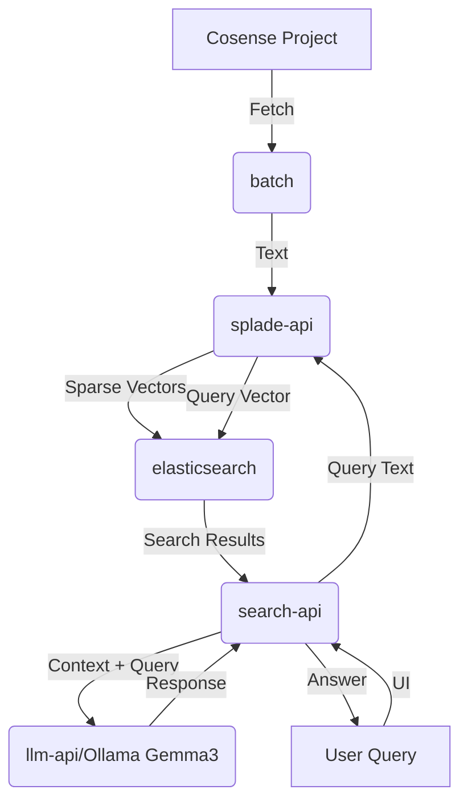

# ARCHITECTURE.md

High-level system architecture for `harness-cosense-rag`.

## System Components

The system consists of the following 6 core components:

1.  **batch**: Data ingestion service that fetches data from Cosense projects.
2.  **splade-api**: Encoding service using the SPLADE model to convert text into sparse vectors.
3.  **elasticsearch**: Vector database for storing and searching encoded data.
4.  **ui**: Web-based user interface for interacting with the system.
5.  **search-api**: Backend service that coordinates searching across Elasticsearch.
6.  **llm-api**: Integration with LLM (Ollama Gemma3) for generating answers based on search results.

## System Flow

