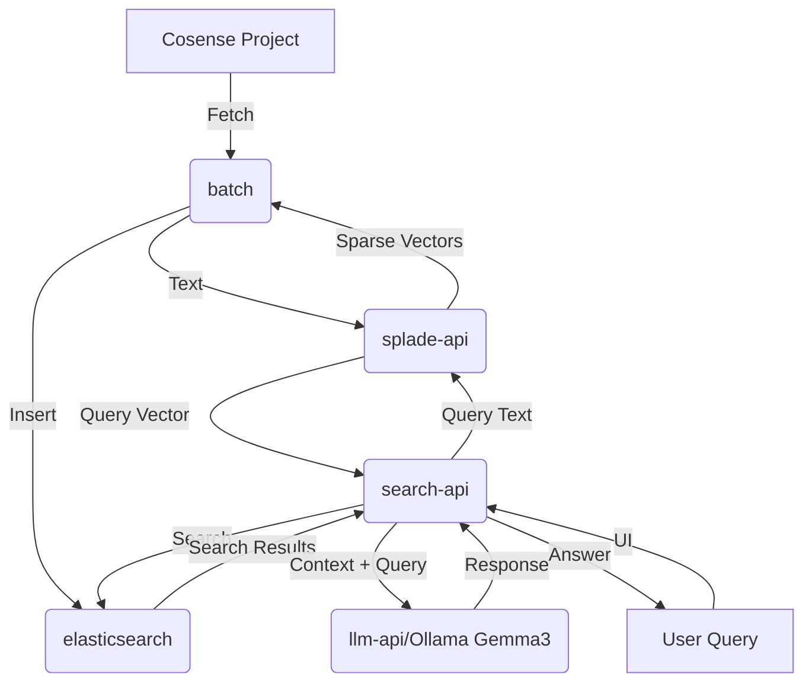

# ARCHITECTURE.md

High-level system architecture for `harness-cosense-rag`.

## System Components

The system consists of the following 6 core components:

1.  **batch**: Data ingestion service that fetches data from Cosense projects.
2.  **splade-api**: Encoding service using the SPLADE model to convert text into sparse vectors.
3.  **elasticsearch**: Vector database for storing and searching encoded data.
4.  **ui**: Web-based user interface for interacting with the system.
5.  **search-api**: Backend service that coordinates searching across Elasticsearch.
6.  **llm-api**: Integration with LLM (Ollama Gemma3) for generating answers based on search results.

## System Flow

The data flow within the system is orchestrated by the `batch` and `search-api` services:

### Data Ingestion Flow (Batch)

1.  **batch** fetches content from a **Cosense Project**.
2.  **batch** sends the text content to **splade-api** for encoding.
3.  **splade-api** returns **Sparse Vectors** to **batch**.
4.  **batch** indexes the **Sparse Vectors** into **elasticsearch**.

### Search Flow (User Query)

1.  **User** enters a query in the **UI**.
2.  **UI** sends the **Query Text** to **search-api**.
3.  **search-api** sends the **Query Text** to **splade-api**.
4.  **splade-api** returns the **Query Vector** to **search-api**.
5.  **search-api** executes a search in **elasticsearch** using the **Query Vector**.
6.  **elasticsearch** returns the **Search Results** to **search-api**.
7.  **search-api** sends the **Context** (search results) and **Query** to **llm-api**.
8.  **llm-api** returns the generated **Response** to **search-api**.
9.  **search-api** returns the final **Answer** to the **UI**.

